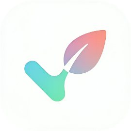
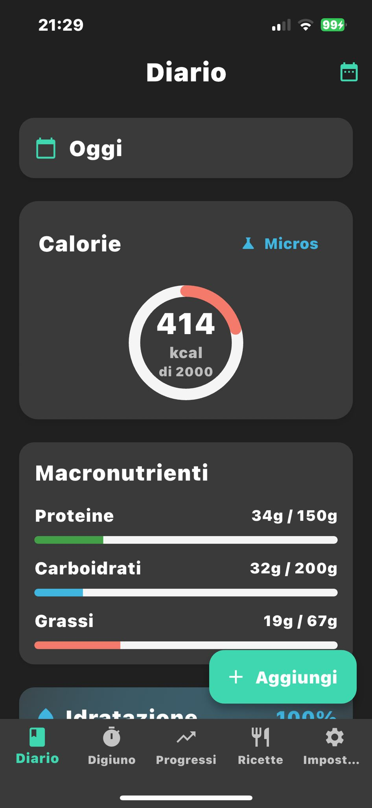
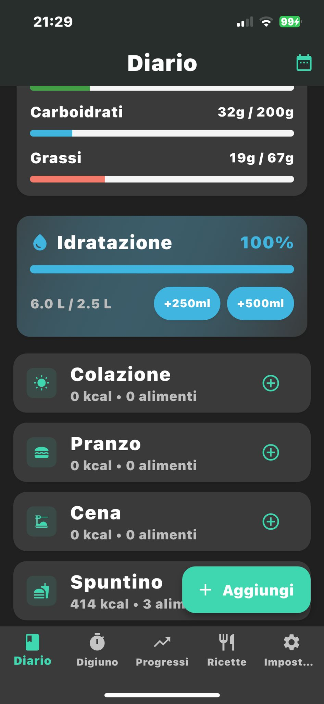
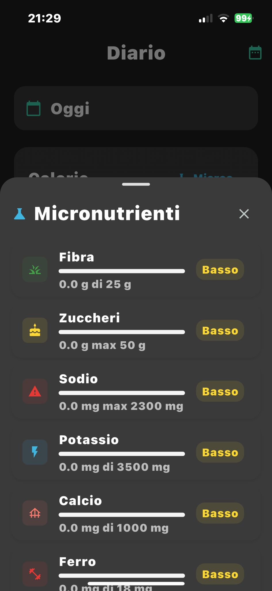

# 🍎 Calories Tracker - App per il Tracciamento Nutrizionale

<div align="center">
  
  
  <p><em>Una semplice e minimale app Flutter per il monitoraggio delle calorie, macronutrienti e digiuno intermittente.</em></p>
  
  
  
  
  
</div>

## 📱 Panoramica del Progetto

**Calories Tracker** è un'applicazione mobile sviluppata in Flutter che permette di tracciare l'alimentazione quotidiana, monitorare i progressi fisici. L'app è progettata per funzionare completamente offline, salvando tutti i dati localmente.

## 📸 Preview dell'App

<div align="center">
  <table>
    <tr>
      <td align="center">
        
        <br><b>📖 Diario Alimentare</b>
        <br><em>Tracciamento pasti e calorie</em>
      </td>
      <td align="center">
        
        <br><b>🍽️ Gestione Pasti</b>
        <br><em>Organizzazione colazioni, pranzi, cene</em>
      </td>
      <td align="center">
        
        <br><b>📊 Micronutrienti</b>
        <br><em>Analisi dettagliata macro e micro</em>
      </td>
    </tr>
  </table>
</div>

## ✨ Caratteristiche Principali

### 🍽️ **Diario Alimentare**
- Tracciamento completo di pasti, snack e bevande
- Database locale di alimenti con informazioni nutrizionali
- Calcolo automatico di calorie, proteine, carboidrati e grassi
- Creazione e gestione di ricette personalizzate
- Scanner barcode per aggiunta rapida prodotti

### 🎯 **Obiettivi Nutrizionali**
- Calcolo automatico del fabbisogno calorico giornaliero (BMR + livello di attività)
- Impostazione target personalizzati per macro-nutrienti
- Visualizzazione progressi con barre colorate e percentuali
- Supporto per diversi obiettivi: perdita peso, mantenimento, aumento massa

### ⏰ **Digiuno Intermittente**
- Timer integrato per sessioni di digiuno
- Supporto per protocolli popolari: 16:8, 18:6, 20:4, OMAD
- Storico completo delle sessioni con statistiche
- Notifiche per inizio e fine digiuno

### 📊 **Monitoraggio Progressi**
- Tracciamento peso corporeo con grafici temporali
- Monitoraggio idratazione giornaliera
- Misurazione circonferenze (vita, petto, braccia)
- Statistiche settimanali e mensili
- Grafici interattivi con fl_chart

### 👤 **Profilo Utente**
- Informazioni personali: età, sesso, altezza, peso
- Calcolo BMI automatico
- Livello di attività fisica personalizzabile
- Preferenze alimentari e restrizioni

## 🏗️ Architettura e Tecnologie

### **Framework e Linguaggi**
- **Flutter 3.9.0+** - Framework UI multipiattaforma
- **Dart** - Linguaggio di programmazione

### **State Management**
- **BLoC Pattern** con `flutter_bloc` - Gestione stato reattiva
- **Cubit** per stati semplici
- **Equatable** per comparazioni di stato ottimizzate

### **Database e Storage**
- **Hive** - Database NoSQL locale ultra-veloce
- **Hive TypeAdapters** - Serializzazione automatica oggetti
- Completamente offline, nessuna connessione internet richiesta

### **UI/UX Design**
- **Design System "Playful-Modern Wellness"**
- Palette colori custom: Verde Acqua, Blu Turchese, Rosa Corallo, Viola Pastello
- Tipografia: Poppins (titoli) + Inter (body text)
- Tema chiaro/scuro supportato
- Animazioni fluide e micro-interazioni

### **Funzionalità Avanzate**
- **Scanner Barcode** con `mobile_scanner`
- **Grafici Interattivi** con `fl_chart`
- **Notifiche Locali** con `flutter_local_notifications`
- **Gestione Permessi** con `permission_handler`

### **🏠 Home/Diario**
- Overview calorie giornaliere vs obiettivo
- Lista pasti con macro breakdown
- Quick add per alimenti frequenti
- Progress bars animate per macro

### **⏱️ Digiuno**
- Timer circolare con countdown
- Selezione protocollo digiuno
- Storico sessioni con statistiche
- Grafici progressi settimanali/mensili

### **📈 Progressi**
- Grafici peso nel tempo
- Tracking idratazione con goal giornaliero
- Circonferenze corporee con comparazioni
- Statistiche nutrizionali aggregate

### **🍳 Ricette**
- Creazione ricette con ingredienti
- Calcolo automatico valori nutrizionali
- Organizzazione per categorie
- Export lista spesa

### **⚙️ Impostazioni**
- Profilo utente e obiettivi
- Preferenze tema (chiaro/scuro)
- Configurazione notifiche
- Backup e ripristino dati

## 🛠️ Setup e Installazione

### **Comandi di Setup**
```bash
# 1. Clona il repository
git clone https://github.com/GabrieleTurelli/calories_tracker.git

# 2. Entra nella cartella
cd calories_tracker

# 3. Installa le dipendenze
flutter pub get

# 4. Genera gli adapter Hive
dart run build_runner build

# 5. Avvia l'app
flutter run
```

## 📱 Piattaforme Supportate

- ✅ **iOS** (iPhone/iPad)
- ✅ **Android** (smartphone/tablet)
- ✅ **macOS** (desktop)
- ✅ **Windows** (desktop)
- ✅ **Linux** (desktop)
- ✅ **Web** (browser)

## 📄 Licenza


Questo progetto è rilasciato sotto licenza **MIT**. Vedi il file `LICENSE` per dettagli completi.